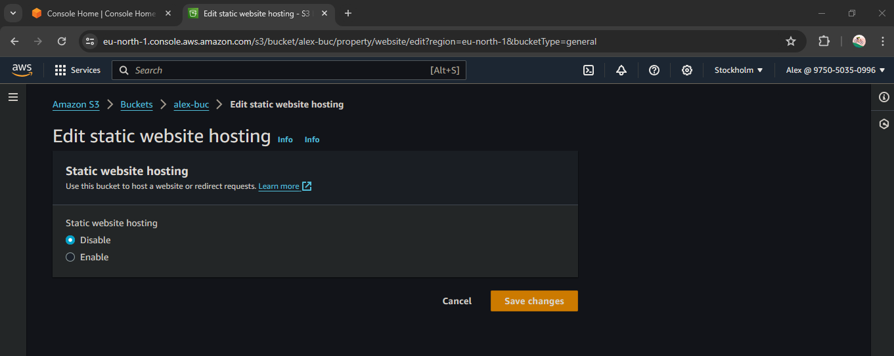
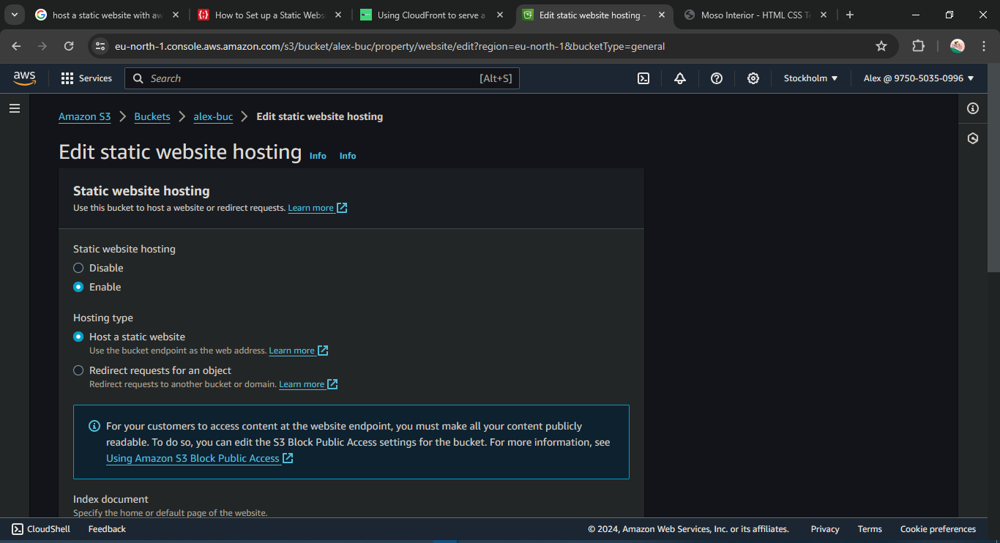
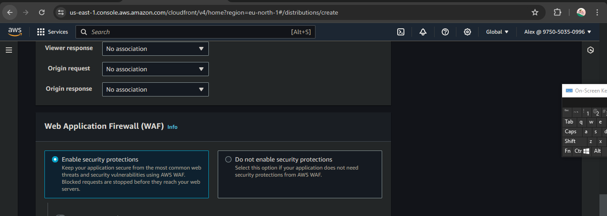
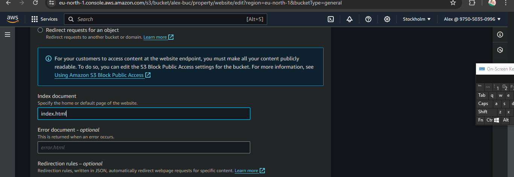
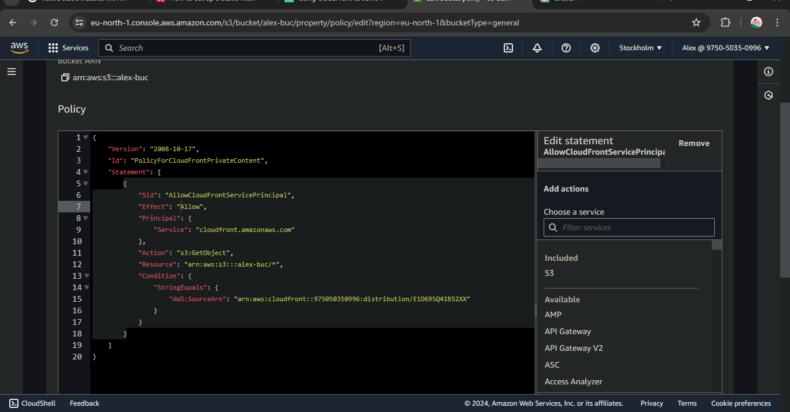
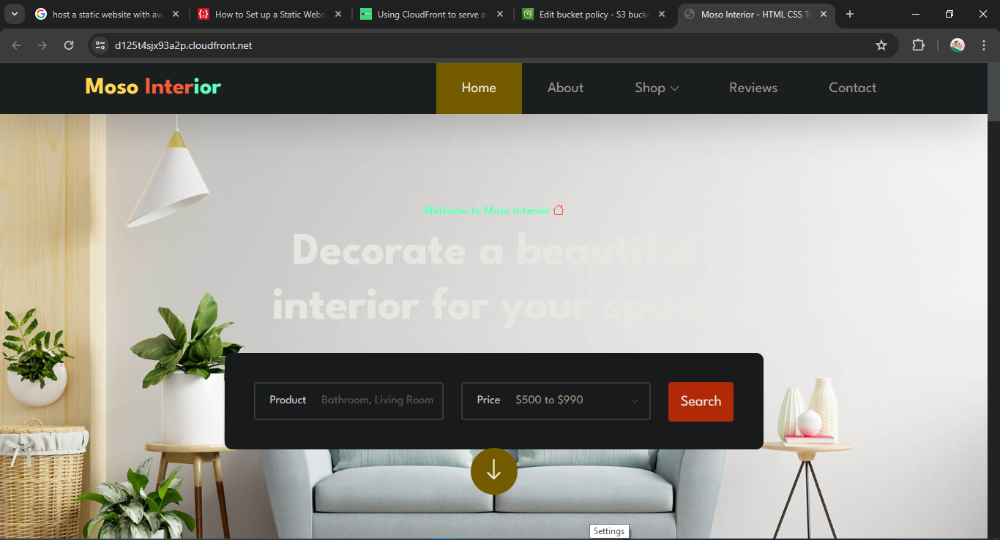

# HOSTING A STATIC WEBSITE USING AWS S3 BUCKET AND CLOUDFRONT

 
 
## Overview
This guide outlines the steps to host a static website on AWS S3 bucket and accelerate its delivery using Amazon CloudFront content delivery network (CDN).
## Prerequisites
Before getting started, ensure you have the following:

     -An AWS account
     -The AWS CLI configured on your local machine
     -A static website ready to be hosted
 
## Steps

 ## Creating S3 Bucket  

     -On the search menu, type S3 
     -Enter any bucket name of your choice e.g alex-buc 

     -Click create bucket  
     -Open the bucket you created

 ## Uploading Files and Folders
 

     -Go to your file manager and upload your file and folder or wherever you saved your files and folders

## Enabling static website hosting
     -Open the bucket you created 
     -Click on properties

 

     -Scroll down and edit static webite hosting
     -At first, it will be disabled

     -Enable it

   

     -Save and exit

## Creating CloudFront Distribution

    
     -On the search menu type in cloudfront and create a new distribution

     -Enter your bucket details in the origin      

    
     -Edit the origin access from public 
     -Click on origin access control settings
     -Create a new origin access control, leave it as default

  

     -Scroll down and Enable security protection

     

     -Type index.html under the index document

     

    -Click on create distribution (It will take few seconds to deploy)

 

     -Copy this policy and paste it inside the bucket policy. To do these;
         -click on bucket you created after copying the policy, 
         -go to your file permission 

 

         -edit the bucket policy and paste 

     -Paste it here and save click save

     -Go back to your cloudFront and copy the distribution domain name

## Testing

     -Paste the distribution domain name on a new webpage
     -Here is the result after running it successfully

   
     With the following steps, I have successfully hosted a static website on AWS S3 bucket and accelerated its delivery using Amazon CloudFront. This website is now highly available and scalable.
